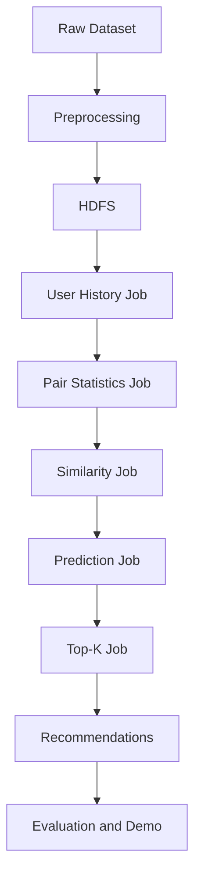

# Architecture

## Overview

The planned system uses an offline batch architecture. Raw rating data will be prepared locally, stored in HDFS, processed by Java MapReduce jobs, and exported as precomputed recommendation files for evaluation or optional demonstration.

The demo, if added in a later milestone, will read precomputed recommendations. It must not rerun the full Hadoop pipeline for each user request.

## Components

- HDFS will act as distributed storage for normalized ratings, intermediate MapReduce outputs, similarity data, prediction scores, and final recommendations.
- Java MapReduce jobs will perform the core distributed computations, including user-history construction, item-pair statistics, similarity calculation, prediction, watched-item filtering, and Top-K selection.
- Python scripts will support preprocessing, validation, evaluation, and plotting.
- An optional demo application may load precomputed recommendation outputs for display.

## Planned Data Flow

## Batch Execution Model

Each stage writes its output as files for the next stage. This keeps the pipeline observable and reproducible, and it allows later milestones to validate intermediate formats independently.
