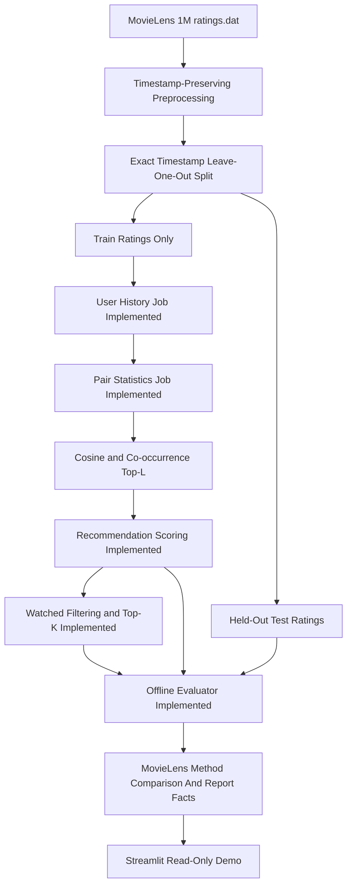

# Architecture

## Overview

The planned system uses an offline batch architecture. Raw rating data is prepared locally, stored in HDFS-compatible local-mode inputs for validation, processed by Java MapReduce jobs, and exported as precomputed recommendation files for evaluation or optional demonstration.

The Streamlit demo reads precomputed recommendations and supporting metrics. It does not rerun the full Hadoop pipeline for each user request.

Milestone 12 makes MovieLens 1M the primary real experimental dataset. The GitHub 15-movie workflow remains as compatibility validation, and synthetic profiles remain scalability-only inputs.

## Components

- HDFS will act as distributed storage for normalized ratings, intermediate MapReduce outputs, similarity data, prediction scores, and final recommendations.
- Maven provides the Java build layer for compiling, testing, packaging, and running local Hadoop smoke checks.
- Java MapReduce jobs perform the Hadoop computations. `UserHistoryJob` is implemented for user-history construction, `ItemPairStatisticsJob` is implemented for co-rated unordered movie-pair statistics, `ItemSimilarityPipeline` is implemented for directed similarity and Top-L neighbor retention, `RecommendationScoringPipeline` is implemented for raw user-candidate score calculation, and `TopKRecommendationJob` is implemented for watched-item filtering and final Top-K recommendation lists.
- Python scripts support preprocessing, local Item-CF reference validation, deterministic train/test splitting, offline evaluation, reproducible benchmark orchestration, and future plotting.
- The Streamlit demo application loads precomputed recommendation outputs for read-only display.

## Implemented And Planned Data Flow



The held-out test ratings bypass user-history construction, item-pair statistics, similarity, scoring, and Top-K generation. They are read only by the offline evaluator after train-only Hadoop recommendation outputs have been produced.

## Batch Execution Model

Each stage writes its output as files for the next stage. This keeps the pipeline observable and reproducible, and it allows later milestones to validate intermediate formats independently.

## Python Reference Validation Path

Milestone 2 adds a local Python Item-CF reference implementation that reads normalized ratings and writes neighbor, recommendation, and statistics files. This does not replace the planned Hadoop architecture; it provides deterministic expected outputs for small fixtures and sample data so later MapReduce jobs can be checked against a known reference.

## Java Hadoop Environment Validation

Milestone 3 adds `LineCountJob`, a minimal Hadoop local-mode smoke job that counts text input records. It validates Java compilation, JUnit execution, Maven packaging, and real Hadoop MapReduce local execution. It is not part of the recommender algorithm and should not be treated as a user-history, pair-statistics, similarity, prediction, or Top-K job.

## User History Stage

Milestone 4 adds `UserHistoryJob`, the first recommender-specific Hadoop stage. It reads normalized ratings, validates rows with `NormalizedRating`, skips exact header rows, groups ratings by user, writes movie histories sorted by movie ID, ignores exact duplicate normalized records, and fails on conflicting duplicate user/movie records.

This stage produces the documented user-history format for Milestone 5. It does not generate item pairs, co-occurrence counts, cosine similarity, neighbors, predictions, recommendations, or evaluation metrics.

## Item-Pair Statistics Stage

Milestone 5 adds `ItemPairStatisticsJob`. It reads user-history rows, validates them with `UserHistoryRecord`, emits unordered item-pair contributions for each user, combines additive partials, and writes:

```text
movieIdA,movieIdB<TAB>commonUsers,sumXY,sumX2,sumY2
```

The custom `ItemPairWritable` compares numeric movie IDs, which keeps one-reducer fixture output deterministic and avoids lexicographic ordering mistakes such as sorting `10` before `2`. The aggregate fields match the Python Item-CF reference pair-statistics semantics.

This stage does not calculate similarity values, retain Top-L neighbors, score recommendations, filter watched movies, produce Top-K results, or evaluate accuracy metrics.

## Item Similarity And Top-L Stage

Milestone 6 adds `ItemSimilarityPipeline`. It reads item-pair statistics, validates rows with `PairStatisticsRecord`, applies `min-common-users`, calculates either cosine or row-normalized co-occurrence similarity, converts unordered pair input into directed neighbor relations, and keeps at most Top-L neighbors per source movie.

The stage writes:

```text
sourceMovieId,neighborMovieId<TAB>similarity,commonUsers
```

Cosine uses `sumXY / sqrt(sumX2 * sumY2)` and produces equal values in both directions. Co-occurrence uses source-specific common-user denominators before Top-L truncation, so directed values can be asymmetric. The final reducer orders retained neighbors by similarity descending and numeric neighbor movie ID ascending.

This stage does not score recommendations, filter watched movies, produce Top-K recommendation rows, split train/test data, or calculate evaluation metrics.

## Recommendation Scoring Stage

Milestone 7 adds `RecommendationScoringPipeline`. It joins user-history rows with retained directed Top-L similarity rows through a secondary-sort reduce-side join keyed by source movie ID. The join reducer stores only the bounded neighbor list for one source movie and streams user rating records to emit typed additive contributions.

The aggregation stage combines contribution numerators, denominators, and contributing item counts for each `userId,movieId` key, then writes:

```text
userId,movieId<TAB>score
```

Scores use the Item-CF weighted-average formula and are formatted with exactly 10 decimal places. Watched movies remain in this raw output by design; the next Hadoop stage consumes these raw rows and removes watched candidates.

## Watched Filtering And Top-K Stage

Milestone 8 adds `TopKRecommendationJob`. It joins user-history rows with raw prediction rows through a secondary-sort reduce-side anti-join keyed by user ID. The reducer reads one user's watched history first, streams that user's raw predictions, filters watched candidates, handles duplicate prediction rows, and keeps a bounded Top-K queue.

The final stage writes precomputed recommendation lists:

```text
userId<TAB>movieId:score,movieId:score,...
```

Recommendations are ordered by score descending and numeric movie ID ascending. List position is the implicit rank. This stage does not split train/test data, compute evaluation metrics, add fallback recommendations, or join movie metadata.

## Evaluation Stage

Milestone 9 adds deterministic offline evaluation. It splits normalized ratings by user and time, builds all Hadoop artifacts from train data only, and evaluates held-out test ratings afterward.

```text
normalized ratings
-> leave-one-out-by-time split
-> train CSV
-> UserHistoryJob
-> ItemPairStatisticsJob
-> ItemSimilarityPipeline
-> RecommendationScoringPipeline
-> TopKRecommendationJob
-> raw predictions and Top-K recommendation files
-> evaluator + held-out test CSV
-> metrics JSON/CSV and per-user diagnostics
```

The evaluator checks that train/test overlap is zero and that final recommendations do not contain train-watched movies. Raw prediction metrics are MAE, RMSE, and prediction coverage. Top-K metrics are Precision@K, Recall@K, Hit Rate@K, NDCG@K, and MRR@K over ranking-eligible users.

This stage does not run scalability experiments, tune hyperparameters, add a web interface, or start Hadoop daemons.

## Scalability Benchmark Stage

Milestone 10 adds reproducible benchmark orchestration around the implemented offline evaluation path:

```text
normalized or synthetic ratings
-> time-aware split
-> train-only Hadoop pipeline
-> offline evaluation
-> benchmark metrics and summary
```

The benchmark runner uses the existing Java Hadoop jobs and evaluation scripts. It records dataset statistics, per-stage runtime, row counts, byte counts, evaluation metrics, manifests, logs, and summary CSV/Markdown files.

The core recommendation pipeline is unchanged. The benchmark measures Linux Docker Hadoop local-mode behavior only; it does not start Hadoop daemons or measure a multi-node cluster.

## Streamlit Read-Only Demo Stage

Milestone 11 adds a local Streamlit presentation layer over offline artifacts:

```text
offline artifacts
-> Streamlit read-only presentation layer
```

The demo loads user-history output, final Top-K recommendations, evaluation metrics, benchmark CSV files, and optional movie metadata. It does not run Hadoop, Maven, Docker, model training, similarity calculation, scoring, or recommendation generation from UI interactions.

## MovieLens 1M Primary Finalization Stage

Milestone 12 wraps the implemented train-only Hadoop pipeline in the MovieLens 1M workflow:

```text
MovieLens 1M ratings.dat
-> exact timestamp preprocessing
-> time-aware split
-> train-only Hadoop pipeline
-> shared pair statistics
-> cosine/cooccurrence
-> raw scoring
-> watched filtering
-> Top-K
-> held-out evaluation
-> report artifacts
-> read-only Streamlit
```

`common/user-history` and `common/pair-statistics` are shared by both similarity methods. The test split never enters user-history, pair-statistics, similarity, scoring, or Top-K stages. It is read only by the evaluator after precomputed train-only artifacts exist.
