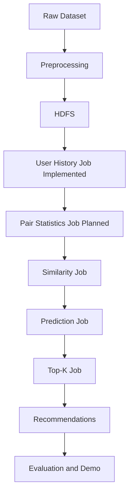

# Architecture

## Overview

The planned system uses an offline batch architecture. Raw rating data will be prepared locally, stored in HDFS, processed by Java MapReduce jobs, and exported as precomputed recommendation files for evaluation or optional demonstration.

The demo, if added in a later milestone, will read precomputed recommendations. It must not rerun the full Hadoop pipeline for each user request.

## Components

- HDFS will act as distributed storage for normalized ratings, intermediate MapReduce outputs, similarity data, prediction scores, and final recommendations.
- Maven provides the Java build layer for compiling, testing, packaging, and running local Hadoop smoke checks.
- Java MapReduce jobs perform the Hadoop computations. The first recommender-specific stage, `UserHistoryJob`, is implemented for user-history construction. Item-pair statistics, similarity calculation, prediction, watched-item filtering, and Top-K selection remain planned.
- Python scripts will support preprocessing, local Item-CF reference validation, evaluation, and plotting.
- An optional demo application may load precomputed recommendation outputs for display.

## Implemented And Planned Data Flow

## Batch Execution Model

Each stage writes its output as files for the next stage. This keeps the pipeline observable and reproducible, and it allows later milestones to validate intermediate formats independently.

## Python Reference Validation Path

Milestone 2 adds a local Python Item-CF reference implementation that reads normalized ratings and writes neighbor, recommendation, and statistics files. This does not replace the planned Hadoop architecture; it provides deterministic expected outputs for small fixtures and sample data so later MapReduce jobs can be checked against a known reference.

## Java Hadoop Environment Validation

Milestone 3 adds `LineCountJob`, a minimal Hadoop local-mode smoke job that counts text input records. It validates Java compilation, JUnit execution, Maven packaging, and real Hadoop MapReduce local execution. It is not part of the recommender algorithm and should not be treated as a user-history, pair-statistics, similarity, prediction, or Top-K job.

## User History Stage

Milestone 4 adds `UserHistoryJob`, the first recommender-specific Hadoop stage. It reads normalized ratings, validates rows with `NormalizedRating`, skips exact header rows, groups ratings by user, writes movie histories sorted by movie ID, ignores exact duplicate normalized records, and fails on conflicting duplicate user/movie records.

This stage produces the documented user-history format for Milestone 5. It does not generate item pairs, co-occurrence counts, cosine similarity, neighbors, predictions, recommendations, or evaluation metrics.
