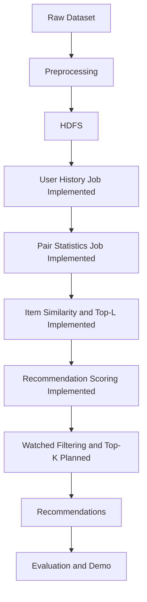

# Architecture

## Overview

The planned system uses an offline batch architecture. Raw rating data will be prepared locally, stored in HDFS, processed by Java MapReduce jobs, and exported as precomputed recommendation files for evaluation or optional demonstration.

The demo, if added in a later milestone, will read precomputed recommendations. It must not rerun the full Hadoop pipeline for each user request.

## Components

- HDFS will act as distributed storage for normalized ratings, intermediate MapReduce outputs, similarity data, prediction scores, and final recommendations.
- Maven provides the Java build layer for compiling, testing, packaging, and running local Hadoop smoke checks.
- Java MapReduce jobs perform the Hadoop computations. `UserHistoryJob` is implemented for user-history construction, `ItemPairStatisticsJob` is implemented for co-rated unordered movie-pair statistics, `ItemSimilarityPipeline` is implemented for directed similarity and Top-L neighbor retention, and `RecommendationScoringPipeline` is implemented for raw user-candidate score calculation. Watched-item filtering and Top-K selection remain planned.
- Python scripts will support preprocessing, local Item-CF reference validation, evaluation, and plotting.
- An optional demo application may load precomputed recommendation outputs for display.

## Implemented And Planned Data Flow



## Batch Execution Model

Each stage writes its output as files for the next stage. This keeps the pipeline observable and reproducible, and it allows later milestones to validate intermediate formats independently.

## Python Reference Validation Path

Milestone 2 adds a local Python Item-CF reference implementation that reads normalized ratings and writes neighbor, recommendation, and statistics files. This does not replace the planned Hadoop architecture; it provides deterministic expected outputs for small fixtures and sample data so later MapReduce jobs can be checked against a known reference.

## Java Hadoop Environment Validation

Milestone 3 adds `LineCountJob`, a minimal Hadoop local-mode smoke job that counts text input records. It validates Java compilation, JUnit execution, Maven packaging, and real Hadoop MapReduce local execution. It is not part of the recommender algorithm and should not be treated as a user-history, pair-statistics, similarity, prediction, or Top-K job.

## User History Stage

Milestone 4 adds `UserHistoryJob`, the first recommender-specific Hadoop stage. It reads normalized ratings, validates rows with `NormalizedRating`, skips exact header rows, groups ratings by user, writes movie histories sorted by movie ID, ignores exact duplicate normalized records, and fails on conflicting duplicate user/movie records.

This stage produces the documented user-history format for Milestone 5. It does not generate item pairs, co-occurrence counts, cosine similarity, neighbors, predictions, recommendations, or evaluation metrics.

## Item-Pair Statistics Stage

Milestone 5 adds `ItemPairStatisticsJob`. It reads user-history rows, validates them with `UserHistoryRecord`, emits unordered item-pair contributions for each user, combines additive partials, and writes:

```text
movieIdA,movieIdB<TAB>commonUsers,sumXY,sumX2,sumY2
```

The custom `ItemPairWritable` compares numeric movie IDs, which keeps one-reducer fixture output deterministic and avoids lexicographic ordering mistakes such as sorting `10` before `2`. The aggregate fields match the Python Item-CF reference pair-statistics semantics.

This stage does not calculate similarity values, retain Top-L neighbors, score recommendations, filter watched movies, produce Top-K results, or evaluate accuracy metrics.

## Item Similarity And Top-L Stage

Milestone 6 adds `ItemSimilarityPipeline`. It reads item-pair statistics, validates rows with `PairStatisticsRecord`, applies `min-common-users`, calculates either cosine or row-normalized co-occurrence similarity, converts unordered pair input into directed neighbor relations, and keeps at most Top-L neighbors per source movie.

The stage writes:

```text
sourceMovieId,neighborMovieId<TAB>similarity,commonUsers
```

Cosine uses `sumXY / sqrt(sumX2 * sumY2)` and produces equal values in both directions. Co-occurrence uses source-specific common-user denominators before Top-L truncation, so directed values can be asymmetric. The final reducer orders retained neighbors by similarity descending and numeric neighbor movie ID ascending.

This stage does not score recommendations, filter watched movies, produce Top-K recommendation rows, split train/test data, or calculate evaluation metrics.

## Recommendation Scoring Stage

Milestone 7 adds `RecommendationScoringPipeline`. It joins user-history rows with retained directed Top-L similarity rows through a secondary-sort reduce-side join keyed by source movie ID. The join reducer stores only the bounded neighbor list for one source movie and streams user rating records to emit typed additive contributions.

The aggregation stage combines contribution numerators, denominators, and contributing item counts for each `userId,movieId` key, then writes:

```text
userId,movieId<TAB>score
```

Scores use the Item-CF weighted-average formula and are formatted with exactly 10 decimal places. Watched movies remain in this raw output by design; filtering and Top-K ranking remain planned for the next milestone.
