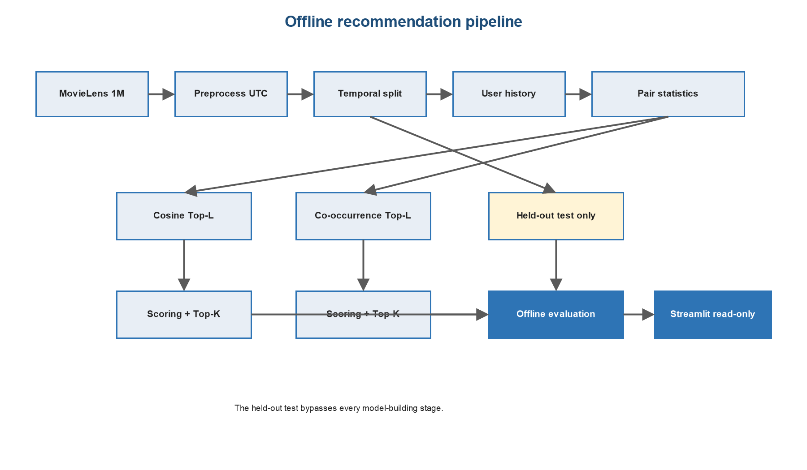
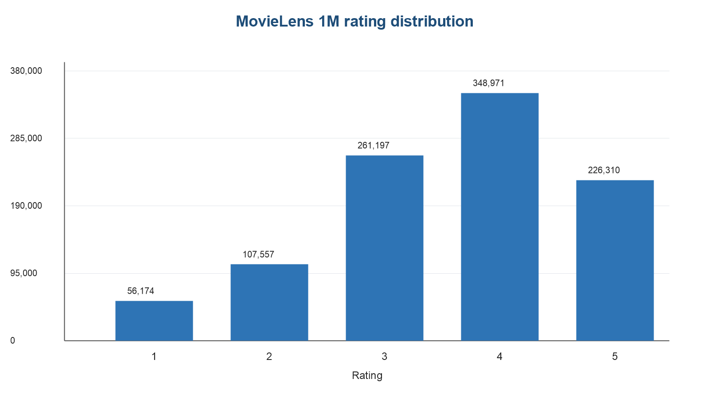
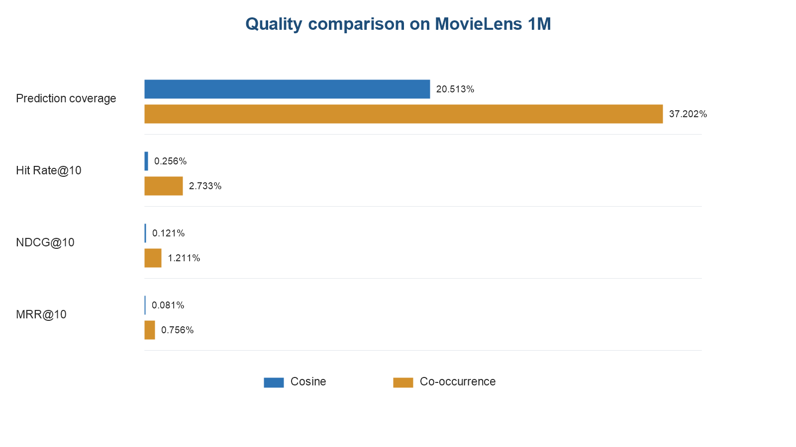
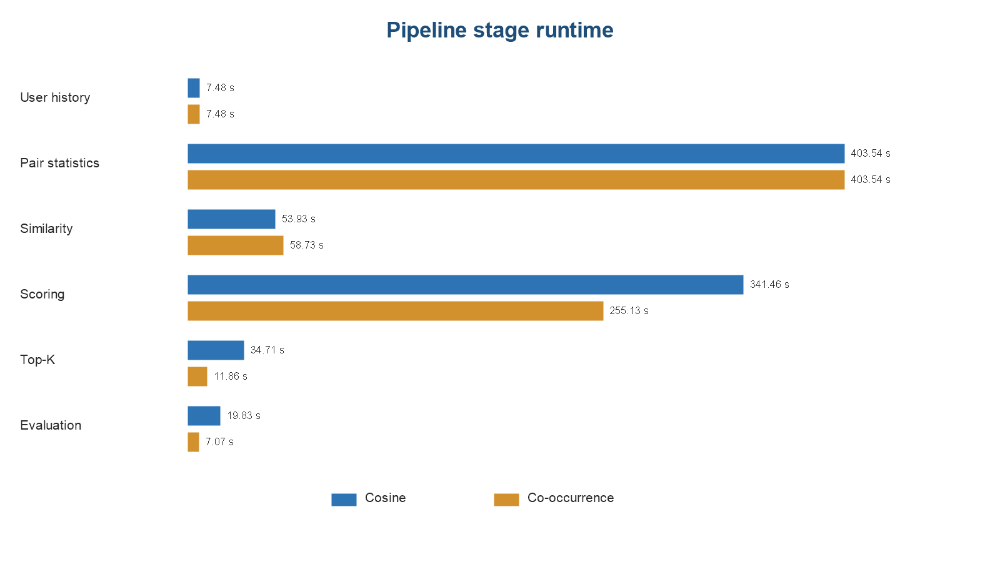
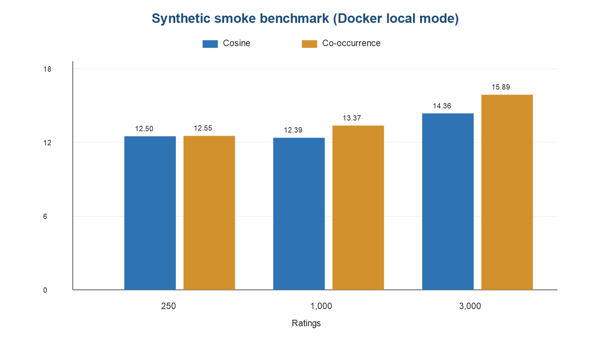

# BÁO CÁO ĐỒ ÁN MÔN HỌC

## XÂY DỰNG HỆ THỐNG GỢI Ý PHIM CÓ KHẢ NĂNG MỞ RỘNG BẰNG ITEM-BASED COLLABORATIVE FILTERING VÀ HADOOP MAPREDUCE

**Báo cáo kỹ thuật và thực nghiệm**

**Bộ dữ liệu thực nghiệm chính:** MovieLens 1M  
**Nền tảng xử lý:** Java 17, Apache Hadoop MapReduce 3.5.0, Maven, Python, Docker và Streamlit  
**Thời điểm hoàn thiện báo cáo:** Tháng 6 năm 2026

[COVER-END]

# LỜI MỞ ĐẦU

Hệ thống gợi ý đã trở thành một thành phần quen thuộc trong các dịch vụ nội dung số. Khi số lượng phim tăng lên, người dùng khó có thể tự tìm hết những nội dung phù hợp với sở thích cá nhân. Một danh sách được sắp xếp dựa trên lịch sử đánh giá giúp giảm thời gian tìm kiếm và tạo ra trải nghiệm sử dụng có định hướng hơn. Tuy nhiên, khi dữ liệu gồm hàng triệu lượt tương tác, bài toán không chỉ nằm ở công thức gợi ý mà còn nằm ở cách tổ chức xử lý dữ liệu sao cho có thể quan sát, kiểm tra và mở rộng.

Đồ án này xây dựng một pipeline gợi ý phim ngoại tuyến dựa trên Item-Based Collaborative Filtering. Các bước tính toán chính được triển khai bằng Java Hadoop MapReduce: tạo lịch sử đánh giá theo người dùng, tổng hợp thống kê cặp phim, tính độ tương đồng, chấm điểm phim ứng viên, loại phim đã xem và giữ lại Top-K. Python được dùng cho tiền xử lý, chia tập theo thời gian, đánh giá ngoại tuyến, điều phối thực nghiệm và kiểm tra artifact. Streamlit đóng vai trò lớp trình bày chỉ đọc trên các kết quả đã được tính trước.

Điểm được ưu tiên trong quá trình thực hiện không phải là tạo ra một con số đẹp bằng mọi giá, mà là giữ cho đường đi của dữ liệu rõ ràng. Tập kiểm thử không được đưa vào bất kỳ bước xây dựng mô hình nào; dự đoán bị thiếu được đếm riêng thay vì gán bằng 0; phim đã có trong lịch sử huấn luyện phải bị loại trước khi xuất Top-K; dữ liệu MovieLens gốc và các artifact dung lượng lớn không được đưa vào Git. Những lựa chọn này làm cho kết quả dễ kiểm tra hơn, đồng thời cũng bộc lộ trung thực các hạn chế của mô hình.

Báo cáo sử dụng trực tiếp số liệu từ các manifest, tệp JSON và CSV đã sinh trong lần chạy MovieLens 1M hoàn chỉnh. Các nhận định về chất lượng chỉ áp dụng cho cấu hình được ghi nhận trong báo cáo, không được xem là kết luận phổ quát về mọi biến thể Item-CF.

# TÓM TẮT

Đồ án giải quyết bài toán sinh danh sách phim gợi ý Top-K từ dữ liệu đánh giá lịch sử bằng Item-Based Collaborative Filtering trên Hadoop MapReduce. Bộ dữ liệu chính là MovieLens 1M, gồm 1.000.209 lượt đánh giá của 6.040 người dùng trên 3.706 phim có phát sinh đánh giá. Dữ liệu có timestamp gốc, vì vậy mỗi người dùng được giữ lại đúng một lượt đánh giá mới nhất làm kiểm thử; 994.169 dòng còn lại được dùng cho toàn bộ pipeline huấn luyện. Số dòng giao nhau giữa train và test bằng 0.

Hai cách tính quan hệ item-item được so sánh trong cùng một pipeline: cosine similarity và co-occurrence được chuẩn hóa theo tổng số đồng đánh giá của từng phim nguồn. Cấu hình thực nghiệm sử dụng Top-L bằng 50, Top-K bằng 10, ngưỡng tối thiểu 5 người dùng chung, ngưỡng liên quan bằng 4 sao và 4 reducer.

Kết quả cho thấy co-occurrence phù hợp với cấu hình hiện tại hơn cosine. Co-occurrence đạt prediction coverage 37,20%, MAE 0,8197, RMSE 1,0700 và Hit Rate@10 2,7327%; cosine đạt coverage 20,51%, MAE 0,9060, RMSE 1,2331 và Hit Rate@10 0,2562%. Tổng thời gian pipeline tương ứng là 743,81 giây và 860,96 giây. Cả hai phương pháp đều sinh đủ 10 gợi ý cho 6.040 người dùng, không có phim đã xem xuất hiện trong danh sách cuối và không có giao nhau train-test.

Kết quả đồng thời chỉ ra hạn chế rõ ràng: coverage của dự đoán điểm còn thấp, chỉ số xếp hạng tuyệt đối còn nhỏ, và thí nghiệm hiệu năng mới được thực hiện trong Docker Hadoop local mode chứ chưa phải cụm nhiều nút. Vì vậy, đóng góp chính của đồ án là một pipeline ngoại tuyến hoàn chỉnh, có khả năng tái lập và có kiểm tra rò rỉ dữ liệu; chưa phải một hệ gợi ý sẵn sàng triển khai thương mại.

**Từ khóa:** hệ gợi ý, Item-Based Collaborative Filtering, Hadoop MapReduce, MovieLens 1M, cosine similarity, co-occurrence, Top-K, đánh giá ngoại tuyến.

[TOC]

# DANH MỤC TỪ VIẾT TẮT

| Từ viết tắt | Diễn giải |
|---|---|
| CF | Collaborative Filtering - lọc cộng tác |
| Item-CF | Item-Based Collaborative Filtering |
| HDFS | Hadoop Distributed File System |
| MAE | Mean Absolute Error |
| RMSE | Root Mean Squared Error |
| NDCG | Normalized Discounted Cumulative Gain |
| MRR | Mean Reciprocal Rank |
| Top-L | Số láng giềng gần nhất được giữ cho mỗi phim nguồn |
| Top-K | Số phim được giữ trong danh sách gợi ý cuối |
| UTC | Coordinated Universal Time |
| UI | User Interface |
| CSV | Comma-Separated Values |
| JSON | JavaScript Object Notation |

# 1. TỔNG QUAN ĐỀ TÀI

## 1.1. Bối cảnh

Một kho phim lớn thường chứa nhiều nội dung mà người dùng chưa từng biết đến. Việc chỉ sắp xếp theo lượt xem hoặc điểm trung bình tạo ra cùng một danh sách cho nhiều người và dễ làm nội dung phổ biến tiếp tục chiếm ưu thế. Hệ gợi ý cá nhân hóa tìm cách khai thác dấu vết hành vi đã có để ước lượng phim nào phù hợp với từng người.

Lọc cộng tác dựa trên giả định rằng các mẫu đánh giá trong quá khứ mang thông tin về sở thích. Với Item-CF, trọng tâm không phải là tìm người dùng giống nhau mà là tìm các phim có quan hệ đánh giá tương tự. Một phim chưa xem sẽ nhận điểm từ các phim người dùng đã đánh giá, có trọng số là độ tương đồng giữa chúng. Cách tiếp cận này có lợi cho xử lý ngoại tuyến vì ma trận quan hệ giữa các phim có thể tính trước và dùng lại cho nhiều người dùng [1].

MovieLens 1M được chọn làm bộ dữ liệu thực nghiệm chính vì đây là bộ benchmark ổn định, có hơn một triệu đánh giá, có timestamp và có mô tả định dạng rõ ràng từ GroupLens [2], [3]. Dữ liệu đủ lớn để làm lộ ra chi phí của bước sinh cặp item, nhưng vẫn phù hợp với phạm vi một đồ án chạy trên máy cá nhân bằng Docker.

## 1.2. Bài toán

Đầu vào của hệ thống là tập các bản ghi:

`(userId, movieId, rating, timestamp)`

Trong đó `rating` là số nguyên từ 1 đến 5. Với mỗi người dùng, hệ thống phải tạo một danh sách tối đa K phim chưa có trong lịch sử huấn luyện, sắp theo điểm dự đoán giảm dần. Khi hai phim có cùng điểm, `movieId` nhỏ hơn được ưu tiên để đầu ra xác định và có thể kiểm thử lặp lại.

Bài toán được chia thành hai phần:

1. Xây dựng mô hình item-item từ tập huấn luyện.
2. Sử dụng mô hình để tạo điểm ứng viên và danh sách Top-K cho từng người dùng.

Tập kiểm thử chỉ được sử dụng sau khi toàn bộ đầu ra huấn luyện đã được tạo. Đây là điều kiện cần để kết quả đánh giá không bị rò rỉ dữ liệu.

## 1.3. Mục tiêu

Đồ án đặt ra các mục tiêu cụ thể sau:

1. Chuẩn hóa MovieLens 1M và bảo toàn timestamp gốc.
2. Chia train-test theo thời gian một cách xác định.
3. Triển khai đầy đủ pipeline Item-CF bằng Hadoop MapReduce.
4. Hỗ trợ hai phương pháp quan hệ item-item là cosine và co-occurrence.
5. Loại phim đã xem và tạo danh sách Top-K ổn định.
6. Đánh giá cả khả năng dự đoán điểm, chất lượng xếp hạng và độ phủ.
7. Lưu manifest, runtime, số dòng và kích thước đầu ra để có thể truy vết.
8. Cung cấp giao diện Streamlit chỉ đọc để trình bày kết quả.
9. Tách rõ dữ liệu thực, dữ liệu tương thích và dữ liệu tổng hợp dùng cho kiểm tra khả năng mở rộng.

## 1.4. Phạm vi

Hệ thống thuộc nhóm xử lý batch ngoại tuyến. Mỗi lần dữ liệu thay đổi, pipeline cần chạy lại để tạo artifact mới. Giao diện không tính gợi ý theo thời gian thực.

Các nội dung nằm trong phạm vi gồm tiền xử lý, chia tập, xây dựng lịch sử người dùng, thống kê cặp phim, tính tương đồng, chấm điểm, lọc phim đã xem, Top-K, đánh giá, benchmark cục bộ và demo.

Các nội dung ngoài phạm vi gồm xác thực người dùng, API phục vụ trực tuyến, học sâu, kết hợp nội dung phim, cập nhật streaming, triển khai HDFS/YARN nhiều nút, A/B testing và cơ chế phản hồi trực tiếp từ người dùng.

## 1.5. Đóng góp của đồ án

Đồ án hoàn thiện một luồng xử lý liên tục từ dữ liệu thô đến giao diện trình bày. Khác với một bản minh họa chỉ tính vài công thức trên bộ dữ liệu nhỏ, pipeline này xử lý toàn bộ MovieLens 1M, ghi lại chữ ký SHA-256 của nguồn quan trọng và xuất artifact riêng cho từng bước.

Một số quyết định kỹ thuật đáng chú ý:

- Lịch sử người dùng và thống kê cặp được tính một lần, sau đó dùng chung cho hai phương pháp tương đồng.
- Dữ liệu kiểm thử bị tách trước khi đưa vào Hadoop.
- Các phép join lớn được tổ chức theo reduce-side join và secondary sort, tránh tải toàn bộ ma trận vào bộ nhớ JVM.
- Top-L và Top-K dùng cấu trúc có giới hạn kích thước.
- Dự đoán thiếu được báo cáo riêng; MAE và RMSE chỉ tính trên các cặp có dự đoán.
- Manifest của lần chạy lưu trạng thái, tham số và đường dẫn artifact để hỗ trợ resume.
- Demo chỉ đọc artifact, không trộn mã giao diện với mã huấn luyện.

# 2. CƠ SỞ LÝ THUYẾT

## 2.1. Hệ gợi ý và lọc cộng tác

Hệ gợi ý có thể dựa trên nội dung, hành vi cộng đồng hoặc kết hợp nhiều nguồn. Trong lọc cộng tác, dữ liệu cốt lõi là ma trận người dùng - item. Mỗi ô đã biết biểu diễn mức độ người dùng đánh giá một item; phần lớn ô còn lại bị thiếu.

User-based CF tìm các người dùng có lịch sử gần với người dùng mục tiêu. Item-based CF tìm các item có mẫu đánh giá gần nhau. Công trình của Sarwar và cộng sự mô tả việc tính trước quan hệ giữa item và sử dụng tổng có trọng số để dự đoán, qua đó giảm khối lượng tìm kiếm láng giềng người dùng khi phục vụ gợi ý [1].

Đồ án chọn Item-CF vì ba lý do. Thứ nhất, quan hệ giữa phim thường ổn định hơn quan hệ giữa người dùng. Thứ hai, mô hình item-item phù hợp với batch processing. Thứ ba, các phép tổng hợp cặp item có thể biểu diễn tự nhiên bằng MapReduce.

## 2.2. Biểu diễn thống kê cặp phim

Với hai phim `i` và `j`, xét tập người dùng đã đánh giá cả hai phim. Pipeline tổng hợp bốn đại lượng:

- `commonUsers(i,j)`: số người dùng chung;
- `sumXY`: tổng `rating(u,i) × rating(u,j)`;
- `sumX2`: tổng `rating(u,i)^2`;
- `sumY2`: tổng `rating(u,j)^2`.

Mỗi cặp được lưu một lần theo thứ tự `movieIdA < movieIdB`. Việc dùng cặp vô hướng ở bước thống kê tránh nhân đôi dữ liệu trung gian. Đến bước tương đồng, mỗi cặp mới được chuyển thành hai quan hệ có hướng.

Nếu một người dùng có `n` phim trong lịch sử, số cặp họ đóng góp là:

`n(n - 1) / 2`

Do đó, người dùng có lịch sử dài có thể làm số cặp tăng nhanh. Đây là nút thắt chính của pipeline và là lý do bước pair statistics chiếm phần lớn thời gian trong lần chạy MovieLens.

## 2.3. Cosine similarity

Độ tương đồng cosine giữa hai phim được tính bằng:

`sim_cos(i,j) = sumXY / sqrt(sumX2 × sumY2)`

Với thang điểm dương từ 1 đến 5, giá trị thu được nằm trong khoảng `(0,1]` đối với các cặp hợp lệ. Cosine đo góc giữa hai vector đánh giá trên tập người dùng chung. Trong cách triển khai của đồ án, giá trị cosine đối xứng: `sim_cos(i,j) = sim_cos(j,i)`.

Ưu điểm của cosine là khai thác cả cường độ đánh giá. Hạn chế là công thức chưa trừ điểm trung bình của người dùng hoặc item, vì vậy người dùng có xu hướng cho điểm cao có thể làm các vector trông giống nhau hơn thực tế. Đồ án giữ công thức này để pipeline rõ ràng và có thể đối chiếu trực tiếp với thống kê `sumXY`, `sumX2`, `sumY2`.

## 2.4. Co-occurrence chuẩn hóa theo phim nguồn

Phương pháp thứ hai bắt đầu từ số người dùng đánh giá chung. Với mỗi phim nguồn `i`, độ tương đồng có hướng đến phim `j` là:

`sim_co(i,j) = commonUsers(i,j) / Σ_k commonUsers(i,k)`

Mẫu số được tính trên tất cả láng giềng đạt ngưỡng `minCommonUsers` trước khi cắt Top-L. Vì mẫu số phụ thuộc phim nguồn, quan hệ này có thể bất đối xứng:

`sim_co(i,j) ≠ sim_co(j,i)`

Cách chuẩn hóa này không đơn thuần là dùng số đếm đồng xuất hiện. Nó biểu diễn tỷ trọng của quan hệ `i -> j` trong tổng khối lượng đồng đánh giá của phim `i`. Sau khi giữ Top-L, các trọng số không được chuẩn hóa lại.

## 2.5. Lọc theo số người dùng chung và Top-L

Các cặp có ít hơn `minCommonUsers` bị loại trước khi tính mẫu số co-occurrence và trước khi giữ Top-L. Ngưỡng này giảm nhiễu từ các cặp chỉ tình cờ có một vài người dùng chung.

Mỗi phim nguồn chỉ giữ tối đa L láng giềng. Thứ tự ưu tiên là:

1. Độ tương đồng giảm dần.
2. `neighborMovieId` tăng dần nếu độ tương đồng bằng nhau.

Top-L kiểm soát kích thước mô hình và số đóng góp ở bước chấm điểm. Đổi lại, một item kiểm thử có thể không còn đường nối từ lịch sử người dùng nếu các quan hệ liên quan bị cắt.

## 2.6. Công thức dự đoán

Với người dùng `u`, phim ứng viên `c` và tập phim `j` mà người dùng đã đánh giá, điểm dự đoán được tính:

`score(u,c) = Σ_j sim(j,c) × rating(u,j) / Σ_j |sim(j,c)|`

Chỉ các quan hệ có hướng `j -> c` còn lại sau Top-L mới đóng góp. Tử số, mẫu số và số lượng item đóng góp được cộng dồn bằng combiner/reducer. Điểm cuối được định dạng 10 chữ số thập phân để đầu ra ổn định.

Công thức không có bias người dùng, bias phim hoặc mean-centering. Vì tất cả trọng số trong hai phương pháp hiện tại đều dương, điểm là trung bình có trọng số của các rating đã biết.

## 2.7. Các chỉ số đánh giá

### 2.7.1. Prediction coverage

`Coverage = số dòng test có dự đoán / tổng số dòng test`

Coverage cho biết hệ thống có thể chấm điểm đúng item được giữ lại ở mức nào. Chỉ số này khác với recommendation user coverage. Một người dùng có thể nhận đủ 10 gợi ý nhưng item kiểm thử cụ thể của họ vẫn không có điểm dự đoán.

### 2.7.2. MAE và RMSE

`MAE = mean(|rating_thực - score_dự_đoán|)`

`RMSE = sqrt(mean((rating_thực - score_dự_đoán)^2))`

Hai chỉ số chỉ tính trên các dòng test có dự đoán. Các dòng thiếu không bị gán điểm 0. Vì vậy MAE/RMSE cần được đọc cùng coverage; một mô hình có sai số thấp nhưng chỉ dự đoán được ít trường hợp chưa chắc hữu ích hơn.

### 2.7.3. Precision@K, Recall@K và Hit Rate@K

Người dùng được xem là đủ điều kiện xếp hạng nếu rating giữ lại lớn hơn hoặc bằng ngưỡng liên quan. Trong giao thức leave-one-out, mỗi người dùng đủ điều kiện chỉ có một item liên quan.

`Precision@K = hit / K`

`Recall@K = hit`

`HitRate@K = hit`

Do mỗi người dùng chỉ có một item liên quan, Recall@K và Hit Rate@K bằng nhau về mặt số học trong thí nghiệm này.

### 2.7.4. NDCG@K và MRR@K

Nếu item liên quan xuất hiện ở hạng `r`:

`NDCG@K = 1 / log2(r + 1)`

`MRR@K = 1 / r`

Nếu không có hit, cả hai bằng 0. NDCG và MRR thưởng nhiều hơn khi item đúng xuất hiện gần đầu danh sách.

## 2.8. Hadoop MapReduce

Apache Hadoop mô tả MapReduce là mô hình xử lý dữ liệu bằng các cặp key-value, trong đó đầu ra map được sắp xếp và đưa đến reducer để tổng hợp [5]. Mô hình này phù hợp với pipeline vì mỗi bước đều có khóa nhóm rõ ràng:

- `userId` để tạo lịch sử;
- cặp `(movieIdA, movieIdB)` để cộng thống kê;
- `sourceMovieId` để giữ Top-L;
- `sourceMovieId` để join láng giềng với rating;
- `(userId, candidateMovieId)` để cộng điểm;
- `userId` để loại phim đã xem và giữ Top-K.

Combiner được sử dụng ở các phép cộng có tính kết hợp. Các bước cần thứ tự bản ghi dùng custom key, partitioner và grouping comparator để thực hiện secondary sort.

# 3. PHÂN TÍCH VÀ THIẾT KẾ HỆ THỐNG

## 3.1. Kiến trúc tổng thể



Hệ thống gồm ba lớp:

1. **Lớp chuẩn bị và điều phối:** Python đọc dữ liệu MovieLens, xác thực, chia tập, gọi các job, tổng hợp số liệu và xây manifest.
2. **Lớp tính toán lõi:** Java Hadoop MapReduce thực hiện các phép nhóm, join và xếp hạng.
3. **Lớp trình bày:** Streamlit đọc artifact đã có để hiển thị lịch sử, gợi ý, chỉ số và thông tin thực nghiệm.

Thiết kế này giữ giao diện tách khỏi pipeline. Một thao tác chọn người dùng trên Streamlit không kích hoạt Hadoop hay thay đổi mô hình.

## 3.2. Luồng dữ liệu và kiểm soát rò rỉ

Luồng chính:

`ratings.dat -> chuẩn hóa timestamp -> temporal split -> train-only Hadoop pipeline -> đánh giá bằng test`

Sau khi chia tập, `test_ratings.csv` không được đưa vào UserHistoryJob, ItemPairStatisticsJob, ItemSimilarityPipeline, RecommendationScoringPipeline hoặc TopKRecommendationJob. Evaluator đọc test cùng raw predictions và Top-K sau khi các artifact huấn luyện đã hoàn thành.

Kiểm soát này được xác minh bằng hai điều kiện:

- `train_test_overlap_rows = 0`;
- `watched_recommendation_violations = 0`.

Điều kiện thứ hai đảm bảo danh sách cuối không chứa phim đã có trong train, nhưng không đồng nghĩa với việc mọi item test đều có thể được dự đoán.

## 3.3. Định dạng dữ liệu chính

### 3.3.1. Dữ liệu rating chuẩn hóa

`userId,movieId,rating,date`

Đối với MovieLens, bản trung gian còn giữ `timestamp` và `dateTimeUtc`. Trước khi đưa vào Hadoop, dữ liệu train được chuyển về schema bốn trường mà các job Java dùng chung.

### 3.3.2. Lịch sử người dùng

`userId<TAB>movieId:rating,movieId:rating,...`

Các phim trong một lịch sử được sắp theo `movieId` tăng dần. Bản ghi trùng hoàn toàn bị bỏ; xung đột cùng user/movie nhưng khác rating làm job thất bại.

### 3.3.3. Thống kê cặp

`movieIdA,movieIdB<TAB>commonUsers,sumXY,sumX2,sumY2`

`movieIdA` luôn nhỏ hơn `movieIdB`, giúp tránh hai khóa cho cùng một cặp.

### 3.3.4. Quan hệ tương đồng

`sourceMovieId,neighborMovieId<TAB>similarity,commonUsers`

Đầu ra có hướng và đã cắt Top-L.

### 3.3.5. Dự đoán thô

`userId,movieId<TAB>score`

Đây là đầu ra trước khi loại phim đã xem. Việc giữ output thô giúp evaluator đo MAE, RMSE và prediction coverage.

### 3.3.6. Gợi ý cuối

`userId<TAB>movieId:score,movieId:score,...`

Danh sách được sắp theo score giảm dần, sau đó theo `movieId` tăng dần.

## 3.4. Thiết kế từng giai đoạn

### 3.4.1. UserHistoryJob

Mapper đọc CSV, bỏ đúng dòng header, xác thực ID, rating và ngày. Khóa map là `userId`; giá trị chứa phim, rating và thông tin cần phát hiện trùng. Reducer tạo lịch sử đã sắp xếp. Job tương ứng với lớp:

`com.movierecommender.history.UserHistoryJob`

### 3.4.2. ItemPairStatisticsJob

Mỗi reducer của lịch sử người dùng phát sinh mọi cặp phim không thứ tự trong lịch sử. Với rating `x` và `y`, đóng góp là:

`(1, x×y, x², y²)`

Combiner cộng các đóng góp cục bộ; reducer cộng toàn bộ theo cặp. Lớp chính:

`com.movierecommender.pairs.ItemPairStatisticsJob`

### 3.4.3. ItemSimilarityPipeline

Pipeline hỗ trợ `cosine` và `cooccurrence`. Sau khi lọc `minCommonUsers`, cặp vô hướng được chuyển thành hai quan hệ có hướng. Reducer Top-L dùng hàng đợi ưu tiên có giới hạn, vì vậy bộ nhớ phụ thuộc L thay vì tổng số láng giềng. Lớp chính:

`com.movierecommender.similarity.ItemSimilarityPipeline`

### 3.4.4. RecommendationScoringPipeline

Pipeline join quan hệ `source -> candidate` với rating của người dùng trên `source`. Secondary sort đảm bảo similarity đến reducer trước rating. Reducer chỉ cần giữ danh sách láng giềng của một phim nguồn rồi stream qua các rating. Các đóng góp tiếp tục được cộng theo `(userId, candidateMovieId)`. Lớp chính:

`com.movierecommender.scoring.RecommendationScoringPipeline`

### 3.4.5. TopKRecommendationJob

Job thực hiện anti-join giữa lịch sử đã xem và dự đoán thô theo `userId`. Lịch sử được đọc trước nhờ secondary sort. Ứng viên đã xem bị loại, bản ghi dự đoán trùng được xử lý xác định, sau đó reducer giữ hàng đợi Top-K. Lớp chính:

`com.movierecommender.recommendation.TopKRecommendationJob`

### 3.4.6. Evaluator

Script `scripts/evaluate_recommendations.py` đọc train, test, raw prediction và Top-K. Ngoài metric, evaluator kiểm tra giao nhau train-test và phim đã xem lọt vào gợi ý. Tệp `per_user_metrics.csv` giúp truy vết hit, rank và dự đoán ở mức người dùng.

## 3.5. Tính xác định và khả năng resume

Các quy tắc tie-break đều dựa trên ID số, không dựa trên thứ tự từ điển. Điểm được định dạng cố định. Mỗi stage có manifest chứa chữ ký input, tham số, status và artifact bắt buộc. Khi chạy với `-Resume`, một stage chỉ được bỏ qua nếu manifest trước đó đã hoàn tất, chữ ký input và tham số khớp, đồng thời output còn tồn tại.

Trong `stage_metrics.json` của lần tổng hợp cuối, các stage xuất hiện với trạng thái `skipped` vì pipeline được chạy ở chế độ resume và artifact hợp lệ đã tồn tại. Manifest riêng của từng stage ghi trạng thái thực là `completed`. Hai cách ghi này không mâu thuẫn: một giá trị mô tả hành động trong lần resume, giá trị còn lại mô tả artifact đã hoàn thành.

# 4. CÀI ĐẶT HỆ THỐNG

## 4.1. Công nghệ

| Thành phần | Phiên bản/vai trò |
|---|---|
| Java | Java 17, cài đặt các job MapReduce |
| Apache Hadoop | Dependency 3.5.0 |
| Maven | Biên dịch, kiểm thử, đóng gói JAR |
| Python | Tiền xử lý, chia tập, đánh giá và orchestration |
| Docker | Môi trường Linux tái lập cho Hadoop local mode |
| Streamlit | Giao diện chỉ đọc |
| JUnit | Kiểm thử lớp Java và job |

Docker image nền là `maven:3.9.9-eclipse-temurin-17`. Image cài thêm Python 3, chạy `mvn clean test package` và Hadoop smoke test. Không có HDFS daemon hoặc YARN daemon được khởi động.

## 4.2. Tiền xử lý MovieLens 1M

Script `scripts/preprocess_movielens_1m.py` yêu cầu bốn tệp `ratings.dat`, `movies.dat`, `users.dat` và `README`. Ở chế độ strict, script kiểm tra:

- đúng 1.000.209 rating;
- đúng 6.040 người dùng;
- rating nguyên từ 1 đến 5;
- mỗi người dùng có ít nhất 20 rating;
- bản ghi không rỗng sai định dạng làm quá trình thất bại;
- trùng hoàn toàn được đếm và bỏ;
- xung đột cùng user/movie làm quá trình thất bại.

Timestamp Unix được bảo toàn và chuyển sang UTC, không dùng múi giờ máy chạy. Metadata phim chỉ phục vụ hiển thị; không tham gia tính điểm.

## 4.3. Chia tập theo thời gian

Với mỗi người dùng:

1. Sắp rating theo timestamp tăng dần.
2. Nếu timestamp bằng nhau, sắp theo `movieId` tăng dần.
3. Giữ lại bản ghi cuối làm test.

Quy tắc này cho đúng một dòng test trên mỗi người dùng và tái lập được. Hai phim test, ID 2226 và 3280, không xuất hiện trong train; đây là trường hợp cold-start item thực tế của phép chia.

## 4.4. Tổ chức mã nguồn

Mã Java được chia theo chức năng:

- `history`: chuẩn hóa bản ghi và lịch sử người dùng;
- `pairs`: khóa cặp item và thống kê cặp;
- `similarity`: cosine, co-occurrence và Top-L;
- `scoring`: join và cộng điểm ứng viên;
- `recommendation`: lọc watched item và Top-K;
- `smoke`: job kiểm tra môi trường.

Mỗi nhóm có lớp dữ liệu `Writable` riêng để tránh ghép chuỗi không cần thiết trong shuffle. Các khóa so sánh `movieId` và `userId` theo số, xử lý đúng trường hợp ID `10` so với `2`.

## 4.5. Điều phối pipeline

`scripts/movielens_1m_pipeline.py` quản lý đường dẫn, tham số, preflight, stage manifest và tổng hợp kết quả. PowerShell wrapper `scripts/run_movielens_1m_docker.ps1` đưa repo và dữ liệu vào container, sau đó gọi pipeline trong Linux.

Các stage dùng chung:

- preprocess;
- split;
- user history;
- pair statistics.

Các stage theo phương pháp:

- similarity;
- scoring;
- Top-K;
- evaluation.

Việc dùng chung pair statistics tránh lặp lại bước tốn thời gian nhất khi so sánh cosine và co-occurrence.

## 4.6. Streamlit

Demo có bốn nhóm nội dung: gợi ý theo người dùng, đánh giá, scalability và kiến trúc. Loader hỗ trợ một file hoặc thư mục Hadoop chứa nhiều `part-*`; các file `_SUCCESS`, CRC, file ẩn và log bị bỏ qua.

Cache của Streamlit dùng chữ ký gồm đường dẫn, kích thước và thời gian sửa đổi. Khi artifact thay đổi, cache key thay đổi theo. Giao diện không có đường gọi đến Maven, Docker hoặc các lớp MapReduce.

# 5. THỰC NGHIỆM VÀ KẾT QUẢ

## 5.1. Bộ dữ liệu MovieLens 1M

Trang dữ liệu chính thức mô tả MovieLens 1M là benchmark ổn định với khoảng một triệu rating của khoảng 6.000 người dùng trên khoảng 4.000 phim [2]. Tệp README xác nhận chính xác 1.000.209 rating và 6.040 người dùng, thang điểm nguyên 1-5 và mỗi người có ít nhất 20 rating [3].

Kết quả tiền xử lý trong đồ án:

| Thuộc tính | Giá trị |
|---|---:|
| Số lượt đánh giá | 1.000.209 |
| Số người dùng | 6.040 |
| Số phim có rating | 3.706 |
| Số dòng metadata phim | 3.883 |
| Rating nhỏ nhất/lớn nhất | 1 / 5 |
| Rating trung bình mỗi người | 165,60 |
| Rating ít nhất/nhiều nhất mỗi người | 20 / 2.314 |
| Rating trung bình mỗi phim | 269,89 |
| Khoảng thời gian UTC | 25/04/2000 23:05:32 - 28/02/2003 17:49:50 |
| Trùng hoàn toàn bị bỏ | 0 |



Rating 4 chiếm tỷ trọng lớn nhất, 34,89%. Rating 4 và 5 cộng lại chiếm 57,52%, cho thấy dữ liệu nghiêng về phản hồi tích cực. Đây là đặc điểm cần lưu ý khi dùng công thức cosine trên rating thô, vì vector item có nhiều thành phần dương và cao.

## 5.2. Kết quả chia train-test

| Thuộc tính | Giá trị |
|---|---:|
| Phương pháp | Leave-one-out theo timestamp chính xác |
| Train | 994.169 dòng |
| Test | 6.040 dòng |
| Tỷ lệ train | 99,3961% |
| Tỷ lệ test | 0,6039% |
| Người dùng có test | 6.040 |
| Giao nhau train-test | 0 |
| Item test không có trong train | 2 |

Tập test nhỏ theo tỷ lệ nhưng phủ toàn bộ người dùng. Đây là giao thức kiểm tra next-item nghiêm ngặt: mô hình phải tìm lại item mới nhất của người dùng từ lịch sử trước đó.

## 5.3. Cấu hình

| Tham số | Giá trị |
|---|---:|
| Top-L | 50 |
| Top-K | 10 |
| Minimum common users | 5 |
| Relevance threshold | 4 |
| Reducers | 4 |
| Phương pháp | Cosine, co-occurrence |

Đây là cấu hình thực nghiệm đã ghi trong manifest, không phải kết quả tối ưu hóa siêu tham số. Đồ án chưa chạy grid search trên nhiều L, K hoặc ngưỡng common users.

## 5.4. So sánh chất lượng

| Chỉ số | Cosine | Co-occurrence |
|---|---:|---:|
| Matched predictions | 1.239 | 2.247 |
| Missing predictions | 4.801 | 3.793 |
| Prediction coverage | 20,5132% | 37,2020% |
| MAE | 0,9060 | 0,8197 |
| RMSE | 1,2331 | 1,0700 |
| Người dùng đủ điều kiện xếp hạng | 3.513 | 3.513 |
| Số hit trong Top-10 | 9 | 96 |
| Precision@10 | 0,0256% | 0,2733% |
| Recall@10 | 0,2562% | 2,7327% |
| Hit Rate@10 | 0,2562% | 2,7327% |
| NDCG@10 | 0,1210% | 1,2108% |
| MRR@10 | 0,0814% | 0,7559% |
| Người dùng có gợi ý | 6.040 | 6.040 |
| Recommendation user coverage | 100% | 100% |
| Vi phạm phim đã xem | 0 | 0 |



Co-occurrence tăng coverage 16,689 điểm phần trăm, tương đương tăng tương đối 81,36% so với cosine. MAE giảm 9,52% và RMSE giảm 13,23%. Hit Rate@10 cao gấp khoảng 10,67 lần, dù giá trị tuyệt đối 2,73% vẫn thấp.

Kết quả cho thấy số lượng gợi ý theo người dùng và prediction coverage không thể dùng thay thế nhau. Cả hai phương pháp đều có 10 gợi ý cho mọi người dùng, nhưng chỉ một phần item test có raw prediction tương ứng. Danh sách Top-K có thể chứa các phim hợp lệ khác mà không chứa đúng phim mới nhất được giữ lại.

## 5.5. Thời gian và kích thước trung gian

| Giai đoạn | Số dòng đầu ra | Dung lượng | Thời gian |
|---|---:|---:|---:|
| User history | 6.040 | 6,71 MB | 7,48 s |
| Pair statistics dùng chung | 5.648.129 | 128,15 MB | 403,54 s |
| Cosine similarity | 168.121 | 4,14 MB | 53,93 s |
| Cosine scoring | 7.857.373 | 177,15 MB | 341,46 s |
| Cosine Top-K | 6.040 | 1,04 MB | 34,71 s |
| Cosine evaluation | - | - | 19,83 s |
| Co-occurrence similarity | 168.121 | 4,33 MB | 58,73 s |
| Co-occurrence scoring | 1.572.127 | 35,41 MB | 255,13 s |
| Co-occurrence Top-K | 6.040 | 1,09 MB | 11,86 s |
| Co-occurrence evaluation | - | - | 7,07 s |



Pair statistics chiếm 46,87% tổng thời gian cosine và 54,25% tổng thời gian co-occurrence. Đây là bằng chứng thực nghiệm cho thấy sinh và tổng hợp cặp item là nút thắt chính.

Cosine tạo 7,86 triệu dòng dự đoán thô, cao gấp khoảng 5 lần co-occurrence, nhưng lại khớp ít item test hơn. Nguyên nhân là Top-L của hai phương pháp chọn các láng giềng khác nhau. Số ứng viên lớn không đảm bảo item tiếp theo của người dùng nằm trong tập ứng viên có ích.

Tổng thời gian:

| Phương pháp | Tổng thời gian pipeline |
|---|---:|
| Cosine | 860,96 s |
| Co-occurrence | 743,81 s |

Co-occurrence nhanh hơn 117,15 giây, tương đương 13,61%. Chênh lệch chủ yếu đến từ scoring và Top-K, không phải bước similarity.

## 5.6. Phân tích kết quả

Trong cấu hình hiện tại, co-occurrence tạo mô hình thưa hơn ở bước scoring nhưng định hướng item test tốt hơn. Trọng số được chuẩn hóa theo tổng quan hệ của phim nguồn làm giảm ảnh hưởng tuyệt đối của các phim có rất nhiều đồng đánh giá. Ngược lại, cosine trên rating thô có xu hướng giữ nhiều quan hệ dương cao, đặc biệt khi dữ liệu thiên về rating 4-5.

Tuy vậy, không nên kết luận co-occurrence luôn tốt hơn cosine. Thí nghiệm mới có một cấu hình và một phép chia xác định. Cosine có thể thay đổi đáng kể nếu rating được mean-center, nếu tăng `minCommonUsers`, thay Top-L hoặc thêm shrinkage. Kết quả chỉ cho phép nói rằng co-occurrence tốt hơn trong pipeline và tham số đã ghi.

Chỉ số xếp hạng thấp có một số nguyên nhân:

1. Mỗi người dùng chỉ có một item test và đó là item mới nhất, khó hơn random split.
2. Không có fallback theo độ phổ biến khi Item-CF không phủ item.
3. Không dùng bias người dùng/phim hoặc hiệu chỉnh trung bình.
4. Top-L bằng 50 có thể cắt quan hệ cần thiết.
5. Ngưỡng 5 người dùng chung loại cặp hiếm.
6. Hai item test hoàn toàn không có trong train.
7. Item-CF thuần túy không dùng genre, năm phát hành hoặc đặc trưng nội dung.

## 5.7. Thử nghiệm scalability bằng dữ liệu tổng hợp

Smoke benchmark dùng dữ liệu tổng hợp với ba kích thước và chạy một lần cho mỗi phương pháp trong Docker local mode.

| Rating | Cosine | Co-occurrence |
|---:|---:|---:|
| 250 | 12,50 s | 12,55 s |
| 1.000 | 12,39 s | 13,37 s |
| 3.000 | 14,36 s | 15,89 s |



Ở các kích thước nhỏ, chi phí khởi động JVM và job chiếm tỷ trọng lớn, nên thời gian không tăng tỷ lệ thuận với số rating. Throughput tăng theo kích thước không có nghĩa thuật toán nhanh lên về độ phức tạp; nó chỉ cho thấy overhead cố định được phân bổ trên nhiều dòng hơn.

Mỗi cấu hình chỉ chạy một lần, vì vậy báo cáo không suy luận phân phối runtime hay ý nghĩa thống kê. Smoke benchmark chứng minh workflow có thể lặp lại trên nhiều kích thước, chưa chứng minh khả năng scale-out của cluster.

## 5.8. Kiểm tra demo và artifact

Kết quả validation Streamlit:

| Kiểm tra | Kết quả |
|---|---|
| Trạng thái tổng | Passed |
| Artifact MovieLens hợp lệ | Có |
| Health check | Passed |
| App test | Passed |
| Metadata đã tải | 3.883 phim |
| Lịch sử đã tải | 6.040 người dùng, 994.169 rating |
| Gợi ý đã tải | 6.040 người dùng, 60.400 item |
| Metadata coverage | 100% |
| Gợi ý trùng | 0 |
| Sai thứ tự | 0 |
| Score không hợp lệ | 0 |
| Phim đã xem lọt Top-K | 0 |

Synthetic benchmark CSV không được nạp trong lần validation cuối; công cụ đánh dấu đây là cảnh báo không nghiêm trọng vì chế độ MovieLens vẫn có đủ artifact chính.

# 6. ĐÁNH GIÁ HỆ THỐNG

## 6.1. Điểm đạt được

Pipeline hoàn chỉnh từ dữ liệu thô đến Top-K và demo. Mỗi bước có định dạng đầu vào/đầu ra rõ ràng, có kiểm tra lỗi và có artifact để xem lại. Việc tách test trước Hadoop, kiểm tra overlap và kiểm tra watched item giúp kết quả đáng tin hơn một phép đánh giá chỉ dựa vào metric cuối.

Thiết kế MapReduce tránh các cấu trúc bộ nhớ toàn cục lớn. Các phép cộng dùng combiner; Top-L/Top-K có kích thước giới hạn; reduce-side join chỉ giữ dữ liệu cần thiết cho một khóa nhóm. Pipeline có thể thay số reducer và đường dẫn mà không sửa mã Java.

Kết quả thực nghiệm không che giấu missing prediction. Điều này đặc biệt quan trọng vì nếu gán thiếu bằng 0 hoặc bỏ qua coverage, người đọc có thể hiểu sai MAE/RMSE.

## 6.2. Hạn chế

Hadoop được chạy ở local mode trong một container. Các số đo không bao gồm truyền dữ liệu qua mạng, HDFS replication, YARN scheduling hoặc ảnh hưởng của nhiều máy. Vì vậy không được dùng runtime trong báo cáo để tuyên bố speedup phân tán.

Mô hình Item-CF còn cơ bản. Cosine dùng rating thô; co-occurrence chỉ dùng số người đánh giá chung; chưa có shrinkage, significance weighting, bias correction, implicit feedback hoặc tối ưu mục tiêu ranking.

Giao thức leave-one-out chỉ giữ một item trên mỗi người dùng. Nó phù hợp kiểm tra next-item nhưng chưa mô tả toàn bộ hành vi dài hạn. Chưa có nhiều lần chia tập, cross-validation hoặc kiểm định ý nghĩa thống kê.

Không có baseline phổ biến như MostPopular, user mean hoặc matrix factorization. Vì thế báo cáo so sánh hai biến thể trong cùng pipeline, chưa trả lời liệu Item-CF có tốt hơn các họ mô hình khác.

## 6.3. Tình trạng kiểm thử khi đóng gói

Manifest validation cuối của dự án ghi trạng thái `passed`, không có lỗi artifact bắt buộc. Các stage manifest MovieLens đều ghi `completed`.

Khi chạy lại `mvn test` trực tiếp trên Windows ngày 25/06/2026, Maven phát hiện 222 test, không có assertion failure nhưng 57 test tích hợp Hadoop local mode dừng ở bước khởi tạo vì máy host không cấu hình `HADOOP_HOME/winutils`. Đây là giới hạn nền tảng đã được dự án dự kiến; đường kiểm tra tích hợp chính là Docker Linux. Báo cáo không coi lần chạy host Windows này là một lần test thành công.

Python launcher trên host hiện trỏ tới Windows App Execution Alias thay vì trình thông dịch thật, nên bộ test Python cũng không được chạy lại trong phiên đóng gói báo cáo. Các artifact MovieLens, benchmark, Streamlit validation và final validation được kiểm tra trực tiếp từ tệp đã sinh.

## 6.4. Rủi ro diễn giải số liệu

MAE/RMSE chỉ tính trên dự đoán khớp. Co-occurrence có coverage cao hơn nên tập trường hợp được đưa vào sai số cũng khác cosine. Không nên xem chênh lệch MAE/RMSE như một so sánh hoàn toàn độc lập với coverage.

Recommendation user coverage bằng 100% không có nghĩa chất lượng cao. Nó chỉ cho biết mỗi người dùng có ít nhất một dòng gợi ý và trong lần chạy này có đủ 10 item.

Stage runtime lấy từ một lần chạy trên một môi trường. Các stage được resume trong lần tổng hợp cuối nhưng elapsed time được bảo toàn từ manifest hoàn thành trước đó. Không có lặp lại để ước lượng phương sai.

# 7. HƯỚNG PHÁT TRIỂN

## 7.1. Cải thiện chất lượng

1. Mean-center rating theo người dùng hoặc item trước cosine.
2. Thêm shrinkage để giảm trọng số các cặp có ít người dùng chung.
3. Tuning Top-L, `minCommonUsers`, Top-K và ngưỡng liên quan trên validation set riêng.
4. Thêm baseline MostPopular để xử lý item không có đường nối và đánh giá mức cải thiện tối thiểu.
5. Kết hợp metadata genre/năm phát hành cho item cold-start.
6. So sánh với matrix factorization hoặc implicit-feedback model.
7. Dùng nhiều cửa sổ thời gian hoặc rolling evaluation.

## 7.2. Cải thiện hiệu năng

Pair statistics là điểm ưu tiên đầu tiên. Có thể:

- giới hạn hoặc lấy mẫu lịch sử quá dài;
- dùng representation nén hơn cho rating;
- tăng reducer trong môi trường cluster;
- cân bằng partition để tránh reducer nóng;
- đánh giá Spark hoặc framework có primitive pair aggregation phù hợp;
- tránh ghi trung gian không cần thiết khi chuyển sang môi trường ổn định.

Scoring cosine tạo lượng output lớn. Có thể lọc ứng viên sớm hơn, giới hạn số đóng góp hoặc dùng threshold tương đồng bên cạnh Top-L.

## 7.3. Triển khai phân tán

Bước tiếp theo về hạ tầng là chạy trên HDFS/YARN thật với nhiều worker. Khi đó cần đo:

- thời gian map, shuffle và reduce;
- bytes đọc/ghi HDFS;
- phân bố task theo node;
- skew khóa;
- tốc độ khi tăng số node;
- chi phí replication và retry.

Chỉ sau các thí nghiệm đó mới có cơ sở nói về khả năng scale-out.

## 7.4. Hoàn thiện sản phẩm

Nếu chuyển từ demo sang hệ thống sử dụng thật, cần có model registry, lịch batch, API đọc gợi ý, kiểm soát phiên bản artifact, giám sát chất lượng, fallback, xác thực, log truy cập và cơ chế thu nhận phản hồi. Streamlit hiện tại nên được giữ như công cụ trình bày và kiểm tra, không phải lớp serving.

# 8. KẾT LUẬN

Đồ án đã xây dựng và chạy hoàn chỉnh một hệ thống gợi ý phim ngoại tuyến bằng Item-Based Collaborative Filtering trên Hadoop MapReduce. Pipeline xử lý toàn bộ MovieLens 1M, tách test theo timestamp, tạo lịch sử người dùng, tổng hợp hơn 5,64 triệu cặp phim, so sánh cosine với co-occurrence, sinh Top-10 cho 6.040 người dùng và đánh giá bằng nhiều nhóm metric.

Trong cấu hình thực nghiệm, co-occurrence cho kết quả tốt hơn cosine cả về coverage, sai số, hit rate và tổng runtime. Tuy nhiên, chỉ số xếp hạng còn thấp và coverage chưa đạt mức đủ cho một hệ thống sản phẩm. Kết quả này phù hợp với mục tiêu học thuật của đồ án: chỉ ra được hệ thống chạy như thế nào, đo được điểm mạnh và điểm yếu, đồng thời không che giấu các trường hợp mô hình không dự đoán được.

Giá trị lớn nhất của phần triển khai nằm ở tính toàn vẹn của pipeline. Dữ liệu test không đi vào huấn luyện; phim đã xem bị loại; output có thứ tự xác định; runtime và artifact được ghi lại; demo không tự ý tính lại mô hình. Nền tảng này đủ rõ để tiếp tục thử nghiệm thuật toán tốt hơn hoặc chuyển sang môi trường Hadoop phân tán thật.

# TÀI LIỆU THAM KHẢO

[1] B. Sarwar, G. Karypis, J. Konstan, J. Riedl, “Item-Based Collaborative Filtering Recommendation Algorithms,” Proceedings of WWW 2001, tr. 285-295. https://grouplens.org/site-content/uploads/Item-Based-WWW-2001.pdf

[2] GroupLens Research, “MovieLens 1M Dataset.” https://grouplens.org/datasets/movielens/1m/

[3] GroupLens Research, “MovieLens 1M README.” https://files.grouplens.org/datasets/movielens/ml-1m-README.txt

[4] F. M. Harper, J. A. Konstan, “The MovieLens Datasets: History and Context,” ACM Transactions on Interactive Intelligent Systems, 5(4), 2015. https://doi.org/10.1145/2827872

[5] Apache Software Foundation, “Apache Hadoop 3.5.0 MapReduce Tutorial.” https://hadoop.apache.org/docs/current/hadoop-mapreduce-client/hadoop-mapreduce-client-core/MapReduceTutorial.html

[6] Streamlit, “st.cache_data API reference.” https://docs.streamlit.io/develop/api-reference/caching-and-state/st.cache_data

[7] Các artifact nội bộ của đồ án: `results/movielens-1m/normalized/dataset_stats.json`, `split/split_stats.json`, `method_comparison.csv`, `stage_metrics.json`, `movielens_1m_manifest.json`.

[8] Các tài liệu thiết kế nội bộ: `docs/architecture.md`, `docs/data_format.md`, `docs/offline_evaluation.md`, `docs/reproducibility.md`.

# PHỤ LỤC A. LỆNH TÁI LẬP THỰC NGHIỆM

## A.1. Xác minh dữ liệu MovieLens

```powershell
python scripts/download_movielens_1m.py `
  --output-dir data/raw/movielens-1m `
  --verify-only
```

## A.2. Tiền xử lý

```powershell
python scripts/preprocess_movielens_1m.py `
  --dataset-dir data/raw/movielens-1m/ml-1m `
  --output-dir results/movielens-1m/normalized `
  --strict-official-counts
```

## A.3. Chạy hoặc tiếp tục pipeline

```powershell
powershell -ExecutionPolicy Bypass `
  -File scripts/run_movielens_1m_docker.ps1 `
  -DatasetDir data/raw/movielens-1m/ml-1m `
  -TopL 50 `
  -TopK 10 `
  -MinCommonUsers 5 `
  -RelevanceThreshold 4 `
  -Reducers 4 `
  -Resume
```

## A.4. Sinh dữ liệu báo cáo

```powershell
python scripts/build_final_report_data.py `
  --output-dir target/final-report-data
```

## A.5. Kiểm tra Streamlit

```powershell
powershell -ExecutionPolicy Bypass `
  -File scripts/validate_streamlit_final.ps1 `
  -Method cosine
```

## A.6. Chạy demo

```powershell
powershell -ExecutionPolicy Bypass `
  -File scripts/run_demo.ps1
```

# PHỤ LỤC B. CẤU TRÚC ARTIFACT CHÍNH

```text
results/movielens-1m/
|-- normalized/
|   |-- ratings_with_timestamp.csv
|   |-- movie_metadata.csv
|   `-- dataset_stats.json
|-- split/
|   |-- train_ratings.csv
|   |-- test_ratings.csv
|   `-- split_stats.json
|-- common/
|   |-- user-history/
|   `-- pair-statistics/
|-- cosine/
|   |-- similarity/
|   |-- raw-predictions/
|   |-- recommendations/
|   `-- metrics.json
|-- cooccurrence/
|-- logs/stage-manifests/
|-- method_comparison.csv
|-- stage_metrics.json
`-- movielens_1m_manifest.json
```

# PHỤ LỤC C. VAI TRÒ CÁC BỘ DỮ LIỆU

| Bộ dữ liệu | Vai trò | Có được dùng làm kết quả chính không? |
|---|---|---|
| MovieLens 1M | Thực nghiệm chất lượng chính, có timestamp | Có |
| GitHub reference 15 phim | Kiểm tra tương thích workflow; không có ngày | Không |
| Synthetic smoke | Kiểm tra pipeline theo kích thước đầu vào | Không |

Bộ GitHub reference có 21.629 rating nhưng chỉ 15 phim, trung bình mỗi người dùng khoảng 1,05 rating. Nguồn không có timestamp nên phải chia không theo thời gian và chỉ 888 người dùng đủ điều kiện có test. Kết quả này không được trộn với MovieLens khi kết luận chất lượng.

# PHỤ LỤC D. NGUỒN GỐC SỐ LIỆU

| Nhóm số liệu | Tệp nguồn |
|---|---|
| Quy mô và phân bố MovieLens | `results/movielens-1m/normalized/dataset_stats.json` |
| Train-test | `results/movielens-1m/split/split_stats.json` |
| Tham số và trạng thái | `results/movielens-1m/movielens_1m_manifest.json` |
| So sánh phương pháp | `results/movielens-1m/method_comparison.csv` |
| Runtime và số dòng stage | `results/movielens-1m/stage_metrics.json` |
| Kiểm tra demo | `target/final-validation/streamlit_movielens_1m_validation.json` |
| Final validation | `target/final-validation/final_validation_manifest.json` |

Các tệp dữ liệu thô và artifact lớn bị Git bỏ qua theo chính sách dữ liệu. Báo cáo này được đặt trong `report/` để có thể commit và nộp cùng mã nguồn.
